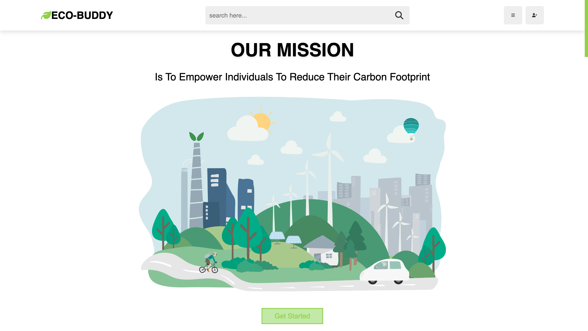

# Eco-Buddy: Carbon Footprint Reduction Platform.

Join Us In Embracing A Sustainable Lifestyle And Making A Positive Impact. Track Your Environmental Footprint, Discover Tips For Energy-Saving, Waste Reduction, And Eco-Friendly Choices. Together, We Can Create A Greener Future. Let's Get Started🌿!
  
  

# Getting Started

1. Clone the Eco-buddy repository from GitHub: git clone https://github.com/bahumuhawa/eco-buddy.git
2. Open the index.html file in your preferred web browser.

